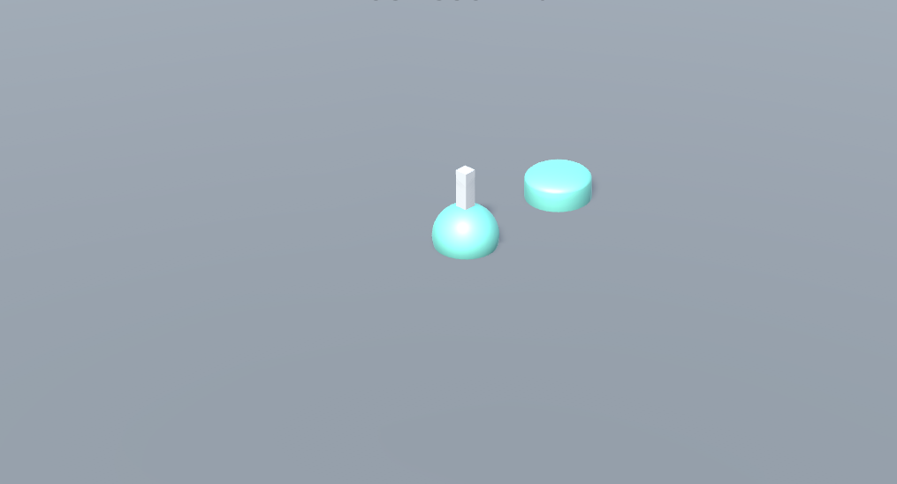

## ORBJUMP

## Developers
               by: OrbJump

## Introduction
This is a unity project.This package is primarily used to test the basic functions and performance of the game, ensuring a smooth gaming experience across a variety of devices. There is an executable file in the game folder that can be played.There is also an apk in this project.
in windows xp above systems test pass ,android 7 above systems test pass.

## Game Rules
1."orbjump" is a simple yet challenging game. Players need to control a character to jump as far as possible on platforms.
2. Players control the jump power of the character by clicking and holding on the screen.
3. The character will automatically jump forward, and the distance of the jump depends on the duration of the screen hold.
4. If the character jumps off the platform, the game ends.

## Getting Started
  First, fork the repository. Then, open orbjump project in unity.
1. git clone https://github.com/youliesihao/OrbJump.git
2. install unity and android module.
3. open orbjump project.
## Control code 
 this game contain four code file ,
 "PlayerController.cs"control player,
 "GameManager.cs"control ramdom create platform,
 "UIManager.cs"control scope and  message,
 "CameraFollow.cs"control view.
## License

This project is licensed under the MIT License.

## Contact Us

If you have any questions or suggestions, please contact us .

